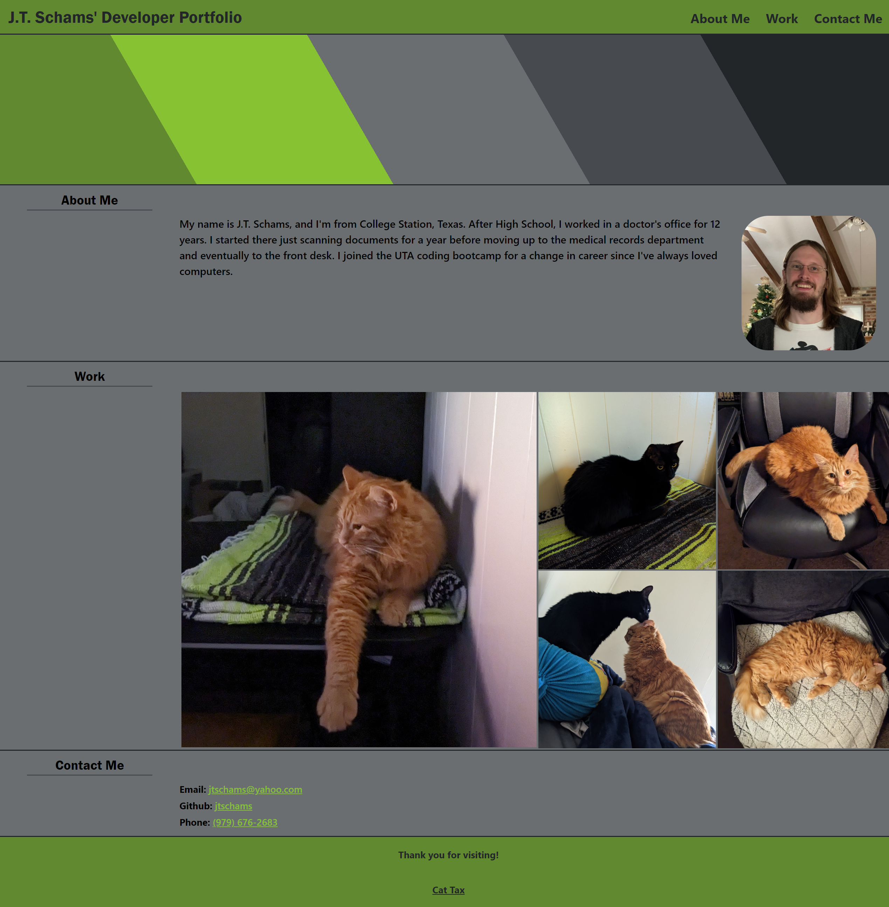

# Portfolio

## Description

This repository is made for the purpose of creating and publishing an online portfolio of what I have made.  It will serve as a reference for any future employers considering me.  Page has basic information about me and my contact information, as well as screenshots and fade-in descriptions of my completed projects

## Visuals

## Technologies Used

HTML 5, CSS 3

## Links

[Page Link](https://jtschams.github.io/Portfolio/)

[Repository link (Github)](https://github.com/jtschams/Portfolio)

[Author Github Profile](https://github.com/jtschams)

## License

Please refer to LICENSE in repository

## Credits

For Reset CSS: \
http://meyerweb.com/eric/tools/css/reset/ \
v2.0 | 20110126 \
License: none (public domain)
